## Quantum Computers

computers that use quantum-mechanical effects (like superposition and entanglement) to process information and solve certain problems much faster than classical machines.
In practice, quantum computers are expected to be broadly useful for two types of tasks: modelling the behaviour of physical systems and identifying patterns and structures in information.
To understand quantum computing, it is important to understand some key quantum mechanics principles
1. **qubit** or quantum bit: is the basic unit of information in quantum computing, similar to a classical bit but capable of existing in a superposition of states.
2. **Superposition**: a state that represents the combination of all possible configurations of the qubit. When a quantum system is observed it falls from a superposition to a binary state (0s and 1s).
3. **Entanglement**: is the ability of qubits to link to each other in a way such that when one is observed from it, it is possible to know something about the entangled qubits.

As we said before most of the currently used cryptography is based one the assumption that factoring very large numbers takes a very long amount of time, surprisingly already someone in 1994 came up with a quantum algorithm to break this assumption, it uses a different kind of math, possible only with quantum computers:

### Shor's algorithm
What it does is reducing factoring to a periodicity problem: instead of directly searching for factors, Shor's algorithm turns factoring into finding the repeat length (period) of a simple function related to the number you want to factor. Finding that period reveals the factors.
It uses a quantum computer to find that period efficiently. The quantum part creates and processes many possibilities at once. Then converts the period back into factors, once you know the period, a few quick classical checks give you the actual prime factors (or you try again with a different starting choice).
Shor's algorithm can factor large integers efficiently on a quantum computer, so simply using longer RSA keys won't prevent a sufficiently powerful quantum attacker from recovering private keys.

### Grover's algorithm
Briefly it is an algorithm finds a target item in an unsorted list of N items in about $\sqrt n$ steps, a quadratic speedup over checking items one-by-one classically. so effective security of an n‑bit key drops to about n/2 bits, putting AES-128 at the same risk level of AES-64. to solve it one can just use AES-256 or AES-512.

## Responses

The threat of quantum computers breaking modern cryptography is no longer theoretical—it's active today through "harvest now, decrypt later" attacks. Most encrypted data today is protected by public-key systems like RSA, but the timeline for practical quantum computers (the "Q-day") remains uncertain. Two main approaches have emerged to resist this threat:

### 1. Post-Quantum Cryptography (PQC)
Mathematics-based cryptography using problems believed to be hard even for quantum computers. However, this assumes the underlying math cannot be broken—a gamble that has historically proven unreliable as new mathematical breakthroughs emerge.

### 2. Quantum Key Distribution (QKD)
Instead of relying on mathematical hardness, QKD leverages the laws of quantum mechanics itself. Any eavesdropping attempt disturbs the quantum state and is immediately detectable, making it physically impossible to eavesdrop without being noticed. The key is then discarded, guaranteeing permanent confidentiality.

**Challenges with QKD:**
- Requires dedicated optical infrastructure (initially limited by distance)
- Early implementations (first-generation QKD) were vulnerable to "blind attacks"
- Relies on secure hardware and trusted nodes in the network
- Technology is advancing (satellite QKD now addresses distance limitations)
- Authentication must still be established separately

### The Hybrid Approach
In practice, neither PQC nor QKD alone is sufficient. The optimal solution combines both:
- **PQC for authentication** — establishes identity with quantum-resistant algorithms (only needs to be secure at that moment)
- **QKD for ongoing communication** — guarantees permanent confidentiality on the authenticated channel

This hybrid model works well for high-security applications, though QKD introduces latency that may not be acceptable in latency-critical contexts like financial markets or critical infrastructure. The future will likely involve multiple solutions operating together rather than a single universal approach.