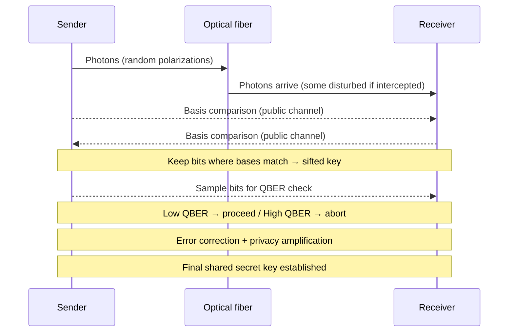

# What is QKD?

In the previous pages we established that the security of classical cryptography rests on mathematical hardness and that quantum computers threaten to dissolve that foundation. **Quantum Key Distribution (QKD)** takes a different approach entirely: instead of making the math harder, it makes eavesdropping physically detectable, using the laws of quantum mechanics as the security guarantee.

## What Travels on a QKD Link

Unlike classical networks where bits are encoded as electrical signals or light pulses of varying intensity, a QKD link transmits individual **photons** — single particles of light — through optical fiber or open air (free-space / satellite links).

Each photon carries a bit (0 or 1), encoded in its **polarization** — the direction in which it vibrates as it travels. Polarization can be:

- **Rectilinear:** horizontal (→) or vertical (↑)
- **Diagonal:** +45° (↗) or −45° (↘)

Crucially, while a photon is in flight it exists in a **superposition** of states, its value is not defined until it is measured. This is not a limitation of our instruments; it is a fundamental property of quantum mechanics. The moment someone measures the photon, its superposition **collapses** into a definite state. And this is the property that makes QKD secure.

## Why Eavesdropping Is Detectable

To intercept a photon, an eavesdropper must measure it. But to measure it, they must choose a **basis** — either rectilinear or diagonal. If they choose the wrong basis (which happens roughly half the time, since the sender's choice is random), they do not simply misread the photon — they **destroy its original quantum state** and replace it with a new, random one. The photon that continues to the receiver is now different from what was sent.

This disturbance is detectable. When sender and receiver later compare a sample of their results, they will find errors that cannot be explained by the channel alone. Those errors are the statistical fingerprint of an eavesdropper. This happens because of **decoherence** — the process by which a quantum state loses its coherence through interaction with its environment, in this case the eavesdropper's measurement — and it works in our favour as a built-in detection mechanism.

## The BB84 Protocol

In 1984, Charles Bennett and Gilles Brassard described the first QKD protocol, known as **BB84**. It remains the foundational reference for QKD systems today.

1. **Sender transmits photons.** The sender generates a random sequence of bits and encodes each one as a photon, choosing randomly between the rectilinear and diagonal basis for each photon.
2. **Receiver measures.** The receiver measures each arriving photon, also choosing a basis at random for each one — independently of the sender.
3. **Basis reconciliation.** Over a classical (public) channel, sender and receiver compare _which basis they used_ for each photon — not the bit values themselves.
4. **Sifting.** They keep only the bits where both happened to choose the same basis. This subset is called the **sifted key**. On average, roughly half the bits survive this step.
5. **Error checking.** They publicly compare a random sample of bits from the sifted key. In an ideal noiseless channel with no eavesdropper, these should match perfectly. In practice, some errors are expected from environmental noise.
6. **QBER calculation.** The mismatch rate is called the **Quantum Bit Error Rate (QBER)**. A low QBER (typically below ~11%) is consistent with environmental noise. A high QBER — approaching the theoretical maximum of ~25% that an eavesdropper introduces — signals interception. The compared bits are discarded after this step since they were shared publicly.
7. **Decision point.**
    - If QBER is within acceptable bounds: proceed.
    - If QBER exceeds the threshold: abort and retry.
8. **Error correction.** Classical error-correction protocols are applied to reconcile the small number of remaining mismatches in the sifted key.
9. **Privacy amplification.** A hash function is applied to the reconciled key, compressing it into a shorter but provably secure final key. Any partial information an eavesdropper may have gathered is made statistically useless — the final key is mathematically unrelated to whatever they observed.

The secret key is never transmitted. It **emerges** from the comparison process — both parties arrive at the same key independently, and any attempt to intercept it leaves a detectable trace.

## Limits and Constraints

### Authentication

BB84 as described does not prevent a **man-in-the-middle attack**. An attacker who intercepts the channel from the start — posing as the receiver to the sender and as the sender to the receiver — can conduct two parallel QKD sessions undetected, since neither side sees anomalous QBER.
> To compromise an authenticated channel (such as performing a man-in-the-middle attack), an adversary must be able to forge digital signatures on the fly during the handshake. If the attacker does not possess a Cryptographically Relevant Quantum Computer (CRQC) at the exact moment the communication is established, they cannot forge the signature and breach the authentication process.

QKD therefore **requires an already-authenticated channel** to bootstrap. In practice this means using classical authentication (asymmetric cryptography or PQC) to verify identities before QKD begins. This is why authentication is always established before deploying QKD — and why the hybrid PQC + QKD approach described in the previous page is the most practical path forward.

### Distance and Attenuation

Photons degrade as they travel through optical fiber. Just as electrical current suffers attenuation over distance, photons are absorbed or scattered by the fiber medium. In practice, QKD over standard optical fiber is limited to roughly **100-200 km** before the signal becomes too weak to be usable. Beyond that, the raw key rate drops to the point where the link is no longer practical.

#### Trusted Nodes

The classical solution to the distance problem is **trusted nodes** — intermediate relay points that terminate one QKD link and start another. A trusted node decrypts the key material it receives and re-encrypts it for the next segment.

This works, but it reintroduces a human trust factor: each trusted node is a physical location that must be secured against physical intrusion, hardware tampering, and insider threats. The security of the entire path is only as strong as its weakest node. This is a significant operational challenge for real QKDN deployments.

#### Satellite QKD

A more promising long-distance solution is **satellite QKD**, which uses free-space optical links through the atmosphere or vacuum rather than fiber. In 2017, China's Micius satellite demonstrated QKD over more than 1,200 km. The lower attenuation in open space dramatically extends the practical range, though atmospheric turbulence and the need for line-of-sight remain engineering challenges.

---

With the physics established, we can now look at how a network of QKD links is organized and managed; introducing nodes, the key management layer, and the agent that coordinates it all.