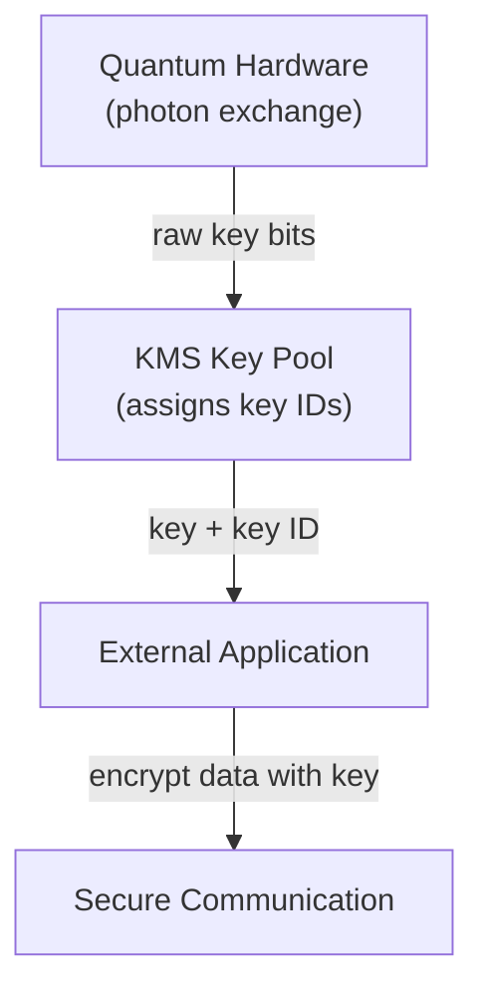

# What is a QKDN?

A single QKD link between two parties is useful, but real-world secure communications require networks: many nodes, many links, routing decisions, failure handling, and management at scale. A **Quantum Key Distribution Network (QKDN)** is the infrastructure that makes this possible: a network of hardware nodes connected by quantum links, coordinated by a software control layer that manages key generation, distribution, and consumption.

## Nodes

A QKDN node is always **hardware-bound**, it is a physical rack of equipment, typically located at a secured facility such as a data center or a trusted relay site. A node is not just a single device; it is a collection of components that together serve several roles in the network:

- **Quantum hardware:** the optical equipment that generates, transmits, and detects photons on QKD links
- **Key Management System (KMS):** software storage that manages the local key pool for each link touching that node
- **Hardware factory:** the component responsible for the actual QKD process — running the BB84 protocol (or equivalent), performing sifting, error correction, and privacy amplification, and pushing the resulting keys into the KMS pool

Nodes are connected to each other by **quantum links**, dedicated optical fiber (or free-space) channels over which photons travel. Each node stores metadata about its links: key size, key type, transmission rate, and current pool status.

Nodes in a QKDN serve as **trusted nodes** in the sense described in the previous page; they are the physical relay points that extend QKD beyond the distance limit of a single link. Their physical security is therefore critical; a compromised node compromises every path that passes through it.

## The Key Pool and How It Fills

Each node maintains a **key pool** for every quantum link it terminates. A key pool can only serve the links that physically touch that node, specifically tehy can only be deployed on the link they are created by.

The filling process works as follows:

1. The quantum hardware on both ends of a link continuously runs the QKD protocol, generating raw key material from photon exchanges.
2. After sifting, error correction, and privacy amplification, the resulting secure bits are pushed into the local KMS key pool.
3. Measure and record the **Effective Secret Key Rate (ESKR)**: the net usable secret bits/sec (or bits/pulse) entering the key pool after sifting, error correction, privacy amplification, and authentication costs.
4. The KMS assigns each key a **key ID**, a unique identifier used to track, request, and consume keys without exposing the key material itself.

When an external service needs to encrypt data, it contacts the KMS through a standardized interface — the **ETSI QKD API (ETSI GS QKD 014)** — and requests a key. The KMS returns a key pair (one to each endpoint of the intended communication), identified by the same key ID, so both sides can independently retrieve the same key without transmitting it over a classical channel.

## The SDN Control Layer

Managing a QKDN manually — tracking key pool levels across dozens of nodes, routing requests through the optimal path, reacting to link failures — would be impractical at scale. This is why QKDNs adopt a **Software Defined Networking (SDN)** architecture.

SDN separates two layers that are traditionally combined:

- **Data plane:** the physical nodes and quantum links, where keys are actually generated and stored
- **Control plane:** a centralized software agent that has a global view of the network and makes routing and provisioning decisions

The **SDN Agent** is the brain of the network. It sits in the control plane and is responsible for:

- Maintaining an up-to-date view of the network state (node availability, key pool levels, active links)
- Receiving provisioning requests from clients
- Deciding whether a request can be fulfilled given current network conditions
- Instructing the relevant KMS nodes to allocate keys for a new link
- Reacting to failures, rerouting requests, flagging degraded nodes

The advantages of this separation are significant for a QKDN specifically: quantum links are fragile, key pools deplete at variable rates, and distance constraints force traffic through specific trusted nodes. A centralized controller with a global view can make optimal path choices, balance load across the network, and respond to failures far faster than any distributed approach.

## Putting It Together

A QKDN is therefore a layered system:

| Layer          | Component                       | Role                                             |
| -------------- | ------------------------------- | ------------------------------------------------ |
| Physical       | Quantum hardware, optical fiber | Photon transmission, key generation              |
| Key management | KMS per node                    | Key storage, tracking, distribution via ETSI API |
| Control        | SDN Agent                       | Network state, provisioning, routing             |
| Application    | Clients                         | Request secure channels, consume keys            |
|                |                                 |                                                  |

The quantum physics happens at the bottom layer. Everything above it is classical software. But software designed around the unique constraints of quantum key material: local pools, fixed generation rates, distance limits, and the irreversibility of key consumption.

This is the conceptual architecture your simulator is built on. The next section maps these concepts directly onto the code.