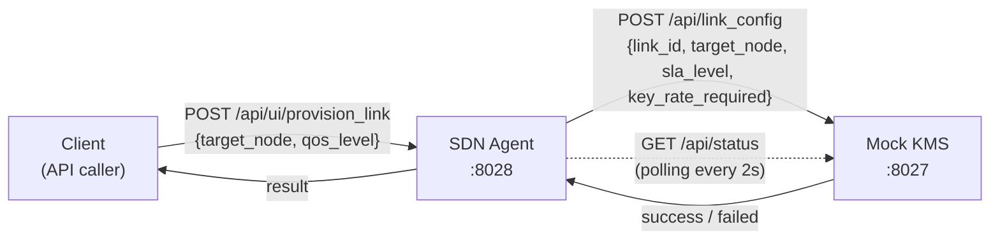

# System Architecture

The simulator is built around three actors: a **Mock KMS**, an **SDN Agent**, and **Clients**. Each maps directly to a real-world QKDN component described in the previous page, with one important caveat: this is a simulator, so the quantum hardware layer is replaced by software approximations. Understanding what is real and what is mocked is essential context before diving into the code.

## What Is Simulated and What Is Real

In a real QKDN, keys are generated by quantum hardware — photon sources, detectors, and the BB84 protocol running continuously on optical fiber. This simulator has none of that hardware. Instead, the Mock KMS runs a background task that adds one key unit to its pool every 100ms:

```python
async def _generate_keys(self):
    while True:
        async with self._lock:
            if self._eskr_pool < self.MAX_ESKR_POOL:
                self._eskr_pool += 1
        await asyncio.sleep(0.1)
```

This approximates the fixed, continuous key generation rate of a real QKD link. Everything else — the agent logic, the provisioning flow, the resilience mechanisms — is real software implementing real patterns used in production SDN and QKDN systems.

## The Three Actors



### Mock KMS (port 8027)

The Mock KMS is the key management layer. It maintains an **ESKR pool** (Effective Secret Key Rate) — a pool of available key units that refills at a fixed rate and depletes as links are provisioned. It exposes two types of endpoints:

- A **public status endpoint** (`/api/status`) used by the Agent to poll the current pool level and active link count
- An **internal provisioning endpoint** (`/api/link_config`) intended only for the Agent — not for direct client access

The KMS does not know about the network topology. It only knows about its own key pool and which links it has provisioned locally. It is deliberately simple: given a provisioning request, it either has enough keys or it does not.

### SDN Agent (port 8028)

The SDN Agent is the control plane of the network. It is the only actor with a global view — it knows the state of the KMS, maintains a record of active links and provisioning history, and is the single entry point for all client requests.

From a **client's perspective**, the Agent is the entire network. Clients never talk to the KMS directly.

From the **KMS's perspective**, the Agent is its only caller. The KMS exposes an internal API that the Agent uses to provision links — no other service should call it.

The Agent runs a **background polling task** that queries the KMS every 2 seconds, keeping its local state up to date with the current ESKR level and active link count. This is how it knows whether a provisioning request can be fulfilled before even contacting the KMS.

### Clients

Clients are any service that wants to establish a secure channel through the network. In this simulator they are represented as HTTP API callers — there is no dedicated client service, just the provisioning endpoint:

```
POST /api/ui/provision_link
```

A client only needs to know two things: **who it wants to connect to** (`target_node`) and **what quality of service it needs** (`qos_level`). It does not speak the KMS's language, it does not know about SLA levels, key rates, or ESKR. That translation is the Agent's responsibility.

## The Translator — A Hidden Boundary

Between the client-facing API and the KMS-facing request sits the **Translator** (`LinkProvisioningTranslator`). It is internal to the Agent — clients never know it exists — but it solves a concrete problem:

Clients express their needs in terms of **QoS levels** (`low`, `normal`, `high`). The KMS speaks in terms of **SLA levels** (`normal`, `high`, `critical`) and raw **key rates**. These are not the same vocabulary, and the mapping is not trivial — it includes a multiplier that scales the key rate requirement based on the QoS level.

with a base key rate of 10, in not specified by client the following is applied based on QoS asked:

| Client QoS | KMS SLA    | Key rate multiplier | Resulting key rate |
| ---------- | ---------- | ------------------- | ------------------ |
| `low`      | `normal`   | ×1                  | 10                 |
| `normal`   | `high`     | ×2                  | 20                 |
| `high`     | `critical` | ×5                  | 50                 |

If the Translator did not exist, clients would need to know the KMS's internal vocabulary and key rate calculations — tightly coupling them to the KMS implementation. Instead, the boundary is clean: clients speak in service terms, the KMS speaks in resource terms, and the Translator bridges the two.

## Ports and Boundaries Summary

|Actor|Port|Talks to|Talked to by|
|---|---|---|---|
|Mock KMS|8027|—|SDN Agent only|
|SDN Agent|8028|Mock KMS|Clients|
|Client|—|SDN Agent|—|

Both services are started together by `main.py`, which launches them as concurrent async applications on their respective ports. They can also be started independently for development purposes.