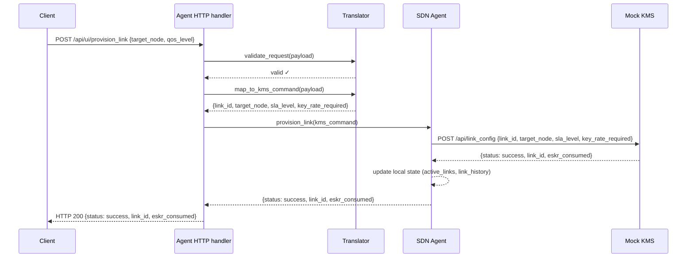

# Provisioning a Link

This page traces the full journey of a single provisioning request through the system — from the moment a client sends an HTTP request to the moment it receives a response. This is the core workflow the entire backend is built around.

For clarity, this page first describes the **happy path**, everything works, the link is provisioned successfully. The resilience mechanisms (circuit breaker, rate limiter, fault injection) are covered in the next section.

## The Full Flow



## Step by Step

### 1. Client Sends a Provisioning Request

A client sends a `POST` request to the Agent's public endpoint:

```
POST /api/ui/provision_link
```

The minimum required payload is:

```json
{
  "target_node": "node-2",
  "qos_level": "normal"
}
```

Optionally, the client can specify `key_rate_required` to override the default, or `duration_seconds` for time-limited links. The client does not need to know anything about SLA levels, key rates, or the KMS — that is the Agent's concern.

### 2. Validation

The Agent's HTTP handler passes the payload to the **Translator** for validation. The Translator checks:

- `target_node` is present and is a non-empty string
- `qos_level` is present and is one of `low`, `normal`, `high`
- If `key_rate_required` is provided, it must be a positive number
- If `duration_seconds` is provided, it must be a positive integer

If validation fails, the handler returns HTTP 400 immediately with a descriptive error. The Agent and KMS are never contacted.

If `key_rate_required` was not provided, the Translator fills in the default based on the QoS level:

| QoS level | Default key rate |
| --------- | ---------------- |
| `low`     | 10               |
| `normal`  | 20               |
| `high`    | 50               |

### 3. Translation

The Translator maps the validated client request to a KMS command — converting the client's vocabulary into the KMS's vocabulary:

```python
kms_command = {
    "link_id": "link-a3f2b1c4",   # generated if not provided by client
    "target_node": "node-2",
    "sla_level": "high",           # mapped from qos_level "normal"
    "key_rate_required": 20,
}
```

The `link_id` is either taken from the client's request (if they specified one) or generated fresh:

```python
link_id = f"link-{str(uuid.uuid4())[:8]}"
```

The difference in the level naming is given by a change of perspective, the SLA levels are named base on resources used from the KMS, QoS are from client point of view.
### 4. Provisioning at the Agent

The HTTP handler passes the translated KMS command to the Agent's `provision_link` method. This is where the resilience mechanisms live — but on the happy path, the Agent proceeds directly to contacting the KMS.

The Agent wraps the actual HTTP call in a **retry handler** (covered in detail in the Resilience section), then sends:

```
POST /api/link_config
{
    "link_id": "link-a3f2b1c4",
    "target_node": "node-2",
    "sla_level": "high",
    "key_rate_required": 20
}
```

### 5. KMS Processes the Request

The KMS receives the request and validates that all required fields are present and that the `sla_level` is supported. It then acquires its internal lock and checks whether the current ESKR pool has enough keys to satisfy the request:

- If `key_rate_required > eskr_pool`: returns `{"status": "failed", "reason": "insufficient_eskr"}`
- If enough keys are available: deducts `key_rate_required` from the pool, records the link in its `active_links`, and returns:

```json
{
    "status": "success",
    "link_id": "link-a3f2b1c4",
    "eskr_consumed": 20
}
```

The lock ensures that concurrent provisioning requests cannot both succeed when only enough keys exist for one — preventing a race condition on the key pool.

### 6. Agent Updates Its State

On receiving a success response from the KMS, the Agent records the circuit breaker success and updates its local state:

```python
self._local_state["active_links"][link_id] = {
    "target_node": kms_command.get("target_node"),
    "qos_level": kms_command.get("sla_level"),
    "eskr_consumed": result.get("eskr_consumed", 0),
}
self._local_state["link_history"].append({
    "link_id": link_id,
    "status": "success",
    "target_node": kms_command.get("target_node"),
})
```

This local state is what gets returned when a UI queries `/api/ui/nodes` — it is the Agent's own record of the network, kept in sync with the KMS through both provisioning responses and the background polling task.

### 7. Response to Client

The Agent returns the KMS result to the HTTP handler, which responds to the client:

```json
{
    "status": "success",
    "link_id": "link-a3f2b1c4",
    "eskr_consumed": 20
}
```

The client now has a `link_id` it can use to reference this secure channel. From the client's perspective, a secure link has been established — the ESKR pool has been allocated, the Agent knows about it, and both sides can use the link ID to identify the channel.

> Note: the other side is never contacted in this process, it's a system limitation. In a real QKDN both endpoints would need to coordinate.

## What Happens on Failure

If the KMS returns `insufficient_eskr`, the Agent propagates the failure back to the client with HTTP 400. The local state is still updated — the failed attempt is recorded in `link_history` — so there is a full audit trail of both successful and failed provisioning requests.