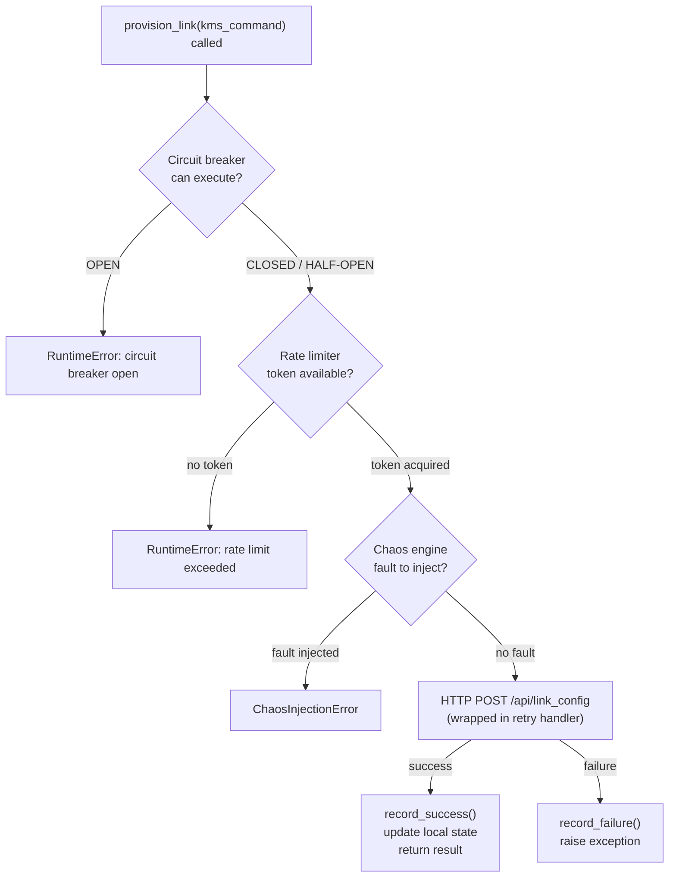

# The SDN Agent

The SDN Agent is the control plane of the simulator. It is the only component with a global view of the network — it knows the state of the KMS, maintains a record of all provisioning activity, and is the single entry point for all client requests. Clients never talk to the KMS directly; everything flows through the Agent.

This page covers the Agent's internal structure: its state, its background polling task, its health tracking, and how all the resilience mechanisms plug into the provisioning flow.

## Internal State

The Agent maintains two pieces of local state at all times.

### `_local_state`

```python
self._local_state = {
    "nodes": [],
    "active_links": {},
    "link_history": [],
}
```

This is the Agent's own record of the network. It is updated in two ways:

- **By the polling task**: every 2 seconds, the Agent queries the KMS and updates `nodes` with the current ESKR level and active link count
- **By provisioning responses**: every time a link is provisioned (successfully or not), the Agent updates `active_links` and appends to `link_history`

The reason for caching this state locally — rather than querying the KMS fresh on every client request — is speed and resilience. If the KMS is temporarily unreachable, the Agent can still respond to status queries instantly from its cache. More importantly, when a client asks for a provisioning and the circuit breaker is open, the Agent can reject the request immediately without attempting a doomed KMS call.

In a real multi-agent deployment, this cached state also matters because the KMS state can change between queries, other agents may have provisioned links in the meantime. This is a known trade-off: the local state is _almost_ real-time, not perfectly real-time. The 2-second polling interval defines the staleness window.

### `_health_status`

```python
self._health_status = {
    "status": "idle",    # "healthy" or "degraded"
    "timestamp": None,
}
```

The health status reflects the Agent's ability to reach its dependencies — in this simulator, solely the KMS. It is set to `"healthy"` after a successful KMS poll and `"degraded"` after a failed one.

This is intentionally separate from the KMS's own `/health` endpoint. The KMS reports its own internal health; the Agent's health status reports _the Agent's view of the world_ — whether it can currently serve requests. In a multi-agent deployment, a load balancer could query each Agent's health status and route client requests away from degraded agents, providing automatic failover without the client ever knowing.

## The Background Polling Task

On startup, the Agent launches a background coroutine that runs continuously:

```python
async def _poll_kms(self):
    while True:
        await self._poll_status_limiter.acquire(wait=True)
        kms_status = await self._retry_handler.execute_with_backoff(
            self.fetch_kms_status
        )
        self.set_local_state({
            "nodes": [{
                "node_id": "node-1",
                "eskr_available": kms_status.get("eskr_available", 0),
                "active_links": kms_status.get("active_links", 0),
            }],
            ...
        })
        self.set_health_status({"status": "healthy", ...})
        await asyncio.sleep(2)
```

A few things worth noting about this loop:

- It goes through the **rate limiter** before each poll — even background tasks respect the rate limits configured for the KMS status endpoint
- It uses the **retry handler** with exponential backoff — if the KMS is temporarily unreachable, the Agent retries with increasing delays rather than hammering a failing service
- On failure, it sets health to `"degraded"` and continues — it never crashes, it just keeps trying

## The Provisioning Flow with Resilience

The happy path provisioning flow was covered in the previous section. Here is the same flow with all resilience mechanisms shown:



Each gate is a deliberate design decision:

1. **Circuit breaker first**: if the KMS has been failing repeatedly, there is no point even acquiring a rate limit token. Fail fast.
2. **Rate limiter second**: prevents the Agent from flooding the KMS with requests even when the circuit is closed.
3. **Chaos engine third**: fault injection happens after the real guards, so it simulates failures at the point of the actual KMS call, not before.
4. **Retry handler wraps the HTTP call**: transient failures (network blips, temporary KMS overload) are retried with exponential backoff before the circuit breaker records a failure.

The circuit breaker only records outcomes at the outermost level — a success resets it, a failure increments it. The retry handler operates inside that boundary, meaning several retries count as a single attempt from the circuit breaker's perspective.

## Endpoints

The Agent exposes both operational and UI endpoints.

### `GET /api/ui/status`

Returns the Agent's current health status and service name. Useful for load balancers and monitoring.

### `GET /api/ui/nodes`

Returns the Agent's cached view of the network nodes, including current ESKR levels and active link counts. This data comes from `_local_state`, not from a live KMS query.

### `GET /api/ui/circuit_breaker_status`

Returns the current state of the circuit breaker — `CLOSED`, `OPEN`, or `HALF_OPEN` — along with failure count and last failure time. Useful for debugging resilience behavior.

### `POST /api/ui/provision_link`

The main client-facing endpoint. Accepts a provisioning request, runs it through the Translator, and delegates to `provision_link()`. Covered in detail in the provisioning flow page.

### `GET /health`

Returns raw health status. Intended for infrastructure monitoring tools.

## Lifecycle

The Agent is designed to start and stop cleanly:

- **On startup:** opens an `aiohttp.ClientSession` for KMS communication and launches the polling task
- **On shutdown:** cancels the polling task gracefully and closes the HTTP session

This ensures no dangling connections or background tasks survive a server shutdown — important for clean Docker container lifecycle management.