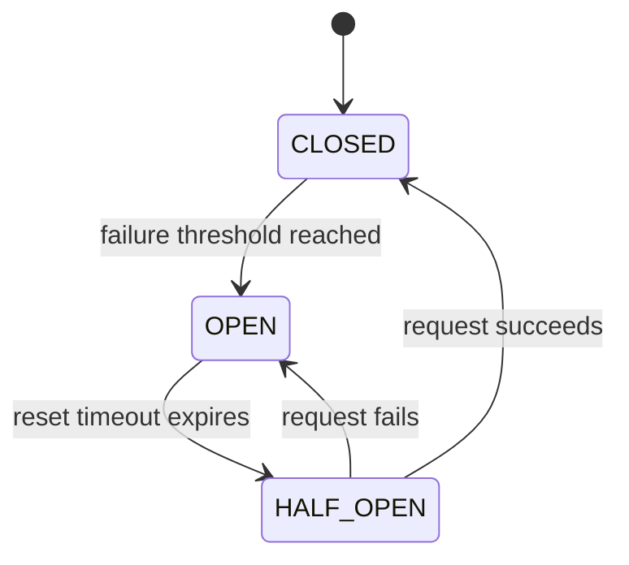

# Resilience Mechanisms

A network agent that talks to an external service — in this case the KMS — will eventually face failures. The KMS might be temporarily overloaded, the network might drop packets, or a bug might cause a cascade of errors. Without protection, a single failing dependency can bring down the entire Agent.

This simulator implements three complementary resilience mechanisms: a **Circuit Breaker**, an **Exponential Backoff Retry Handler**, and a **Token Bucket Rate Limiter**. Each protects against a different failure mode, and they are deliberately layered — the circuit breaker is checked first, then the rate limiter, then the actual request is made with retry logic wrapping it.

Two circuit breaker models were designed for this system. The simpler one was implemented; the more sophisticated one is documented here as a reference, since it reflects patterns used in production systems.

---
## Circuit Breaker

The circuit breaker prevents the Agent from repeatedly calling a dependency that is known to be failing. Rather than letting every client request result in a slow timeout against an unreachable KMS, the circuit breaker detects the failure condition early and returns an error immediately — **failing fast** to save time and resources.

It is modelled as a state machine with three states:



### States

**CLOSED**: normal operation. Requests pass through. Every result (success or failure) is recorded.

**OPEN**: the KMS is considered unavailable. All requests are rejected immediately without contacting the KMS. The Agent waits for a configured `reset_timeout` before trying again.

**HALF-OPEN**: a probe state. After the timeout expires, the circuit breaker allows one request through. If it succeeds, the circuit closes and normal operation resumes. If it fails, the circuit opens again and the timeout restarts.

### Model 1 — Consecutive Failures (Implemented)

The implemented model uses a simple consecutive failure counter. Three failures in a row opens the circuit; one success resets it. The reset timeout is 30 seconds.

```python
CIRCUIT_BREAKER_THRESHOLD: int = 3
CIRCUIT_BREAKER_RESET_TIMEOUT: int = 30
```

This model is deliberately simple because the simulator has one Agent talking to one KMS. The failure signal is clear — if three calls in a row fail, something is genuinely wrong — and the recovery signal is equally clear.

### Model 2 — Sliding Window with Health Tiers (Designed, Not Implemented)

For a system with many agents, many services, and high request volume, the consecutive failure model is too blunt. A single slow request followed by a fast success would reset the counter, masking a genuinely degraded service.

The alternative model tracks a **sliding window** of the last N requests and calculates a success rate. Rather than a binary healthy/broken distinction, it introduces health tiers:

|Success rate|Health tier|Action|
|---|---|---|
|> 80%|Healthy|Normal operation|
|70–80%|Unstable|Activate linear backoff on retries|
|60–70%|Degraded|Switch to exponential backoff|
|< 60%|Failing|Circuit opens|

```python
SLIDING_WINDOW_SIZE = 100       # requests to track
MIN_REQUEST_VOLUME = 10         # minimum before evaluating
HEALTH_TIER_HEALTHY_THRESHOLD = 80
HEALTH_TIER_UNSTABLE_THRESHOLD = 70
CIRCUIT_BREAKER_FAILURE_RATE_THRESHOLD = 60
HALF_OPEN_PERMITTED_CALLS = 3   # test requests in half-open
HALF_OPEN_SUCCESS_THRESHOLD = 3 # successes needed to close
```

This model makes sense when there are enough requests to make the percentage meaningful, and when there are multiple services to route between — the unstable tier can trigger load balancing before the circuit fully opens.

---

## Retry Handler — Exponential Backoff

The retry handler deals with **transient failures**: errors that are temporary and likely to resolve on their own, such as a momentary network blip or a KMS that is briefly overloaded. Rather than immediately failing the request, it retries with increasing delays.

The delay grows exponentially after each failure:

```
attempt 1 fails → wait 1s
attempt 2 fails → wait 2s
attempt 3 fails → wait 4s
attempt 4 fails → wait 8s
attempt 5 fails → give up
```

```python
BACKOFF_INITIAL_DELAY: float = 1.0
BACKOFF_MULTIPLIER: float = 2.0
BACKOFF_MAX_DELAY: float = 60.0
BACKOFF_MAX_ATTEMPTS: int = 5
```

The delay is capped at 60 seconds to prevent indefinitely long waits. After `MAX_ATTEMPTS`, the exception is re-raised and the circuit breaker records a failure.

The retry handler wraps the actual HTTP call, meaning several retries count as a single attempt from the circuit breaker's perspective. This is intentional: transient failures should not penalize the circuit breaker counter.

### Adaptive Backoff (Designed, Not Implemented)

The second circuit breaker model introduced a more nuanced backoff strategy, taking inspiration from TCP slow start and Wi-Fi collision avoidance:

- **Linear increase** while failures are limited (unstable tier): add a fixed increment per retry (`+2s, +4s, +6s...`)
- **Exponential increase** once failures accumulate (degraded tier): double the delay each time
- **Backoff preservation**: when the circuit opens, the current backoff value is preserved rather than reset — so half-open test requests continue with the same delay, reflecting how long recovery is actually taking
- **Jitter**: a ±25% random offset is added to each delay

```python
LINEAR_BACKOFF_THRESHOLD = 3      # failures before switching to exponential
LINEAR_INCREMENT_MS = 2000        # increment per retry in linear phase
JITTER_FACTOR = 0.25              # ±25% randomness
PRESERVE_BACKOFF_ON_CIRCUIT_OPEN = True
```

**Why jitter?** Without it, multiple agents that all backed off for the same duration would all retry at exactly the same moment, creating a synchronized burst that could overwhelm the recovering service. Adding a small random offset spreads the retries out in time, the same principle used in Wi-Fi's CSMA/CA collision avoidance and the hidden node problem mitigation.

The full state progression with adaptive backoff:

```
CLOSED, healthy (>80%)    → no backoff, normal operation
CLOSED, unstable (70-80%) → linear backoff: +2s, +4s, +6s per retry
CLOSED, degraded (60-70%) → exponential backoff: 8s, 16s...
OPEN (<60%)               → all requests blocked, backoff preserved at 16s
HALF-OPEN                 → test requests spaced 16s apart
  → fail (recent)         → back to OPEN, backoff → 32s
  → fail (stale)          → back to OPEN, backoff reset to 1s
  → success               → CLOSED, backoff reset
```

---

## Token Bucket Rate Limiter

The rate limiter prevents the Agent from overwhelming the KMS with too many requests, even when the circuit is closed and the service is healthy.

### How It Works

The token bucket algorithm maintains a bucket with a maximum capacity. Tokens refill at a fixed rate. Each request consumes one token. If a token is available, the request proceeds immediately. If not, the request is either rejected or queued to wait.

```
bucket capacity: 10 tokens
refill rate: 5 tokens/second

t=0s: 10 requests arrive → all served immediately (bucket empties)
t=0s: 11th request → rejected or waits
t=0.2s: 1 token refills → 1 queued request served
t=1s: 5 tokens refilled → 5 more requests can be served
```

This is the key difference from a simple "maximum N requests per second" rule: the bucket **accumulates unused capacity** during quiet periods and makes it available as burst headroom when traffic spikes. A simple counter would reject the 6th request in a second even if the system was idle for the previous 10 seconds.

### Three Separate Limiters

The simulator uses three independent rate limiters, one per operation type:

```python
PROVISION_LINK_RATE_LIMIT: float = 5.0    # max requests/sec for provisioning
POLL_LINK_STATUS_RATE_LIMIT: float = 10.0 # max requests/sec for status polling
KMS_STATUS_RATE_LIMIT: float = 20.0       # max requests/sec for KMS status
```

A single global limiter would mean a flood of status check requests could consume tokens needed for provisioning — the most critical operation. Separate limiters give each operation its own guaranteed capacity, independent of the others.

The provisioning limiter is configured with `wait=False` — if no token is available, the request is rejected immediately with an error rather than queuing. The polling limiter uses `wait=True` — the background task will wait for a token rather than skip a poll cycle.

---

## How They Work Together

The three mechanisms are not alternatives — they address different problems and are always active simultaneously:

|Mechanism|Protects against|Response|
|---|---|---|
|Circuit breaker|Repeatedly failing dependency|Fail fast, skip the call entirely|
|Rate limiter|Overloading a healthy dependency|Reject or queue excess requests|
|Retry handler|Transient, recoverable failures|Retry with increasing delays|

Their order in the provisioning flow is deliberate: circuit breaker first (no point acquiring a token for a known-broken service), rate limiter second (no point retrying if we're over the limit), retry handler last (wraps only the actual network call).