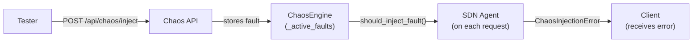

# The Chaos Engine

A resilient system is not one that never fails — it is one that handles failure gracefully. The three resilience mechanisms covered in the previous section (circuit breaker, retry handler, rate limiter) are only useful if they have actually been tested against realistic failure conditions. The **Chaos Engine** is the tool that creates those conditions.

## What It Is

The Chaos Engine is a **fault injection system**. It allows a tester to programmatically introduce failures into the system — network timeouts, HTTP errors, artificial latency — at controlled probability levels, targeting specific endpoints, for a defined duration. The goal is to observe how the Agent responds: does the circuit breaker open correctly? Does the retry handler recover? Does the client receive a meaningful error?

This practice is called **chaos engineering** — deliberately breaking parts of your own system in a controlled environment to find weaknesses before they appear in production. The name comes from Netflix's "Chaos Monkey," a tool that randomly terminated production servers to force engineers to build resilient services.

## Architecture

The Chaos Engine has three layers:



**The Chaos API** — a set of HTTP endpoints for managing faults. Used by a tester or test script, never by the system itself.

**The ChaosEngine** — the core class. Maintains a dictionary of active faults, checks them on each request, and decides probabilistically whether to trigger one.

**The SDN Agent** — calls `should_inject_fault()` before every KMS operation. If a fault is triggered, it raises a `ChaosInjectionError` which propagates up to the HTTP handler and returns a server-side error to the client.

## Fault Configuration

Each injected fault is configured with:

```python
ChaosConfig(
    fault_type=FaultType.HTTP_500,     # what kind of fault
    probability=0.3,                    # chance of triggering per request
    affected_endpoints={                # which operations to target
        EndpointFilter.PROVISION_LINK
    },
    duration_seconds=60,               # auto-expire after 60s (optional)
    latency_ms=200,                    # for LATENCY fault type
    error_details="simulated failure", # custom error message
)
```

### Fault Types

Eight fault types are defined:

|Fault type|Models|
|---|---|
|`NETWORK_TIMEOUT`|KMS unreachable, connection hangs|
|`CONNECTION_REFUSED`|KMS process not running|
|`HTTP_500`|KMS internal server error|
|`HTTP_429`|KMS rate limit exceeded|
|`MALFORMED_RESPONSE`|Corrupted response body|
|`PARTIAL_RESPONSE`|Truncated response|
|`LATENCY`|Slow KMS response|
|`TRANSIENT_ERROR`|Temporary, recoverable failure|

**Important caveat:** in the current implementation, all fault types are handled identically by the Agent — a `ChaosInjectionError` is raised regardless of fault type, and the HTTP handler catches it and returns a `503 SERVICE_UNAVAILABLE`. The fault type distinction is preserved in the error details and statistics, but the Agent does not yet simulate each fault's specific behavior (e.g., actually sleeping for `latency_ms` on a `LATENCY` fault, or returning a `429` response for `HTTP_429`). This is a known limitation and a natural area for future development.

### Endpoint Filters

Faults can target specific operations:

|Filter|Targets|
|---|---|
|`ALL`|Every KMS operation|
|`PROVISION_LINK`|Link provisioning requests only|
|`FETCH_KMS_STATUS`|KMS status fetch only|
|`POLL_KMS`|Background polling task only|

This allows precise testing — for example, degrading only the polling endpoint to test whether the Agent's cached state remains usable when fresh data is unavailable.

## How a Fault Triggers

When the Agent is about to make a KMS call, it first asks the Chaos Engine:

```python
fault_type = await self._chaos_engine.should_inject_fault(EndpointFilter.PROVISION_LINK)
if fault_type:
    raise ChaosInjectionError(fault_type, fault_type.value)
```

Inside `should_inject_fault`:

1. If the engine is disabled, return `None` immediately
2. Remove any expired faults from `_active_faults`
3. Find all faults whose `affected_endpoints` includes this endpoint (or `ALL`)
4. For each applicable fault, roll `random.random()` against its `probability`
5. If the roll triggers, increment counters and return the `FaultType`
6. If nothing triggers, return `None`

A fault with `probability=0.3` is not dormant — it is active and checked on every request, firing roughly 30% of the time. The randomness models reality: real failures do not happen on every request, they happen unpredictably. Testing against a fault that always fires is less useful than testing against one that fires occasionally, because the latter reveals whether the system behaves correctly under _intermittent_ failure — which is the hardest case to handle.

## The Chaos API

The engine is controlled entirely through HTTP endpoints:

|Method|Endpoint|Action|
|---|---|---|
|`POST`|`/api/chaos/inject`|Inject a new fault|
|`DELETE`|`/api/chaos/inject/{fault_id}`|Remove a specific fault|
|`DELETE`|`/api/chaos/clear`|Remove all faults|
|`GET`|`/api/chaos/active`|List active faults|
|`GET`|`/api/chaos/inject/{fault_id}`|Get fault details|
|`GET`|`/api/chaos/stats`|Get injection statistics|
|`GET`|`/api/chaos/enabled`|Check if engine is enabled|
|`POST`|`/api/chaos/enable`|Enable the engine|
|`POST`|`/api/chaos/disable`|Disable the engine|

### Example: Injecting a Fault

```bash
curl -X POST http://127.0.0.1:8028/api/chaos/inject \
  -H "Content-Type: application/json" \
  -d '{
    "fault_type": "http_500",
    "probability": 0.5,
    "duration_seconds": 30,
    "affected_endpoints": ["provision_link"]
  }'
```

Response:

```json
{ "status": "success", "fault_id": "3f2a1b4c-..." }
```

For the next 30 seconds, roughly half of all provisioning requests will fail with a simulated HTTP 500. The circuit breaker will record these failures — after 3 consecutive failures, it will open. The retry handler will attempt recovery. The tester can observe the full resilience stack responding to a realistic failure scenario.

## What Could Be Added

The current implementation is a foundation. A more complete chaos engine might:

- **Simulate fault behaviors distinctly** — actually sleeping for `latency_ms` on `LATENCY` faults, returning actual `429` responses for `HTTP_429`, truncating response bodies for `PARTIAL_RESPONSE`
- **Simulate eavesdropper behavior** — injecting noise into the key generation process to model a quantum channel under attack, raising the QBER and triggering the QKD abort mechanism
- **Target intermediate nodes** — in a multi-node network, injecting faults at a specific trusted node to test path rerouting and failover
- **Monitor client conversations** — observing active links and injecting faults mid-conversation to test whether clients detect and recover from key material corruption

These extensions would require a more complex architecture — active monitoring of in-flight requests, hooks into the key generation simulation, and network topology awareness. They represent the natural evolution of the simulator toward a genuine QKDN resilience testing platform.