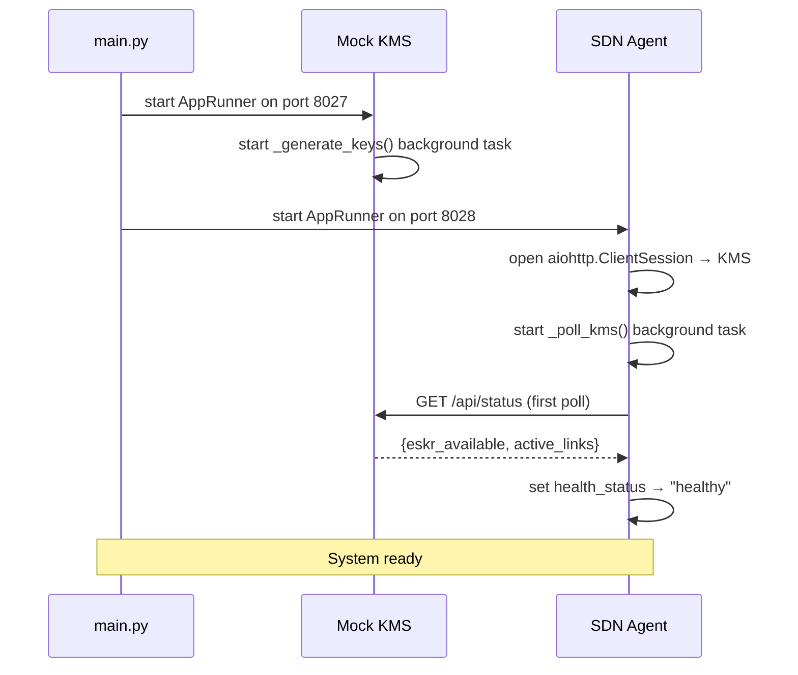

# Running the System

This page covers everything needed to get the simulator running locally, understand what is happening when it starts, and interact with it through its endpoints.

## Prerequisites

- Python 3.11+ with `uv` package manager, or a standard Python environment
- Docker and Docker Compose (optional, for containerized setup)

## Starting the System

### Option 1 — Local (recommended for development)

From the `backend` directory:

```bash
uv run python -m main
# or without uv:
python -m main
```

This starts both services together:

- **Mock KMS** on port `8027`
- **SDN Agent** on port `8028`

`main.py` launches both as concurrent async applications in the same event loop. Stop with `Ctrl-C` — both services shut down cleanly, cancelling background tasks and closing HTTP sessions.

### Option 2 — Services separately (for debugging)

Run only the Agent (useful when you want to test it against a separately managed KMS):

```bash
uv run -m app.agent_server
```

Run only the KMS:

```bash
uv run -m app.kms_server
```

Make sure ports do not conflict if running both manually.

### Option 3 — Docker

Build and run as a single container:

```bash
cd backend
docker build -t qkdn-backend:local .
docker run --rm -p 8027:8027 -p 8028:8028 qkdn-backend:local
```

Or use Docker Compose:

```bash
cd backend
docker-compose up --build
```

## What Happens on Startup

Understanding the startup sequence helps when debugging:



On first poll the Agent may briefly show `"idle"` health status — this is normal and resolves within 2 seconds once the first KMS poll completes.

## Running Tests

```bash
cd backend
uv run pytest -v
```

## Endpoints Reference

### Mock KMS (port 8027)

|Method|Endpoint|Description|
|---|---|---|
|`GET`|`/api/status`|Current ESKR pool level and active link count|
|`GET`|`/api/capabilities`|Node ID, max pool size, supported SLA levels|
|`POST`|`/api/link_config`|Provision a link (Agent use only)|
|`GET`|`/health`|KMS health status|

### SDN Agent (port 8028)

|Method|Endpoint|Description|
|---|---|---|
|`GET`|`/health`|Agent health status|
|`GET`|`/api/ui/status`|Agent status and service info|
|`GET`|`/api/ui/nodes`|Cached network state (nodes, ESKR, active links)|
|`GET`|`/api/ui/circuit_breaker_status`|Circuit breaker state and failure count|
|`POST`|`/api/ui/provision_link`|Provision a new link (client-facing)|
|`POST`|`/api/chaos/inject`|Inject a fault|
|`DELETE`|`/api/chaos/inject/{fault_id}`|Remove a specific fault|
|`DELETE`|`/api/chaos/clear`|Remove all faults|
|`GET`|`/api/chaos/active`|List active faults|
|`GET`|`/api/chaos/inject/{fault_id}`|Get fault details|
|`GET`|`/api/chaos/stats`|Chaos engine statistics|
|`GET`|`/api/chaos/enabled`|Check if chaos engine is enabled|
|`POST`|`/api/chaos/enable`|Enable chaos engine|
|`POST`|`/api/chaos/disable`|Disable chaos engine|

## Example Interactions

### Check system is running

```bash
curl http://127.0.0.1:8027/api/status
```

```json
{
  "status": "online",
  "eskr_available": 87,
  "active_links": 0
}
```

```bash
curl http://127.0.0.1:8028/api/ui/status
```

```json
{
  "status": "ok",
  "service": "SDN Agent",
  "agent_status": "healthy"
}
```

### Provision a link

```bash
curl -X POST http://127.0.0.1:8028/api/ui/provision_link \
  -H "Content-Type: application/json" \
  -d '{"target_node": "node-2", "qos_level": "normal"}'
```

```json
{
  "status": "success",
  "link_id": "link-a3f2b1c4",
  "eskr_consumed": 20
}
```

### Provision with explicit key rate

```bash
curl -X POST http://127.0.0.1:8028/api/ui/provision_link \
  -H "Content-Type: application/json" \
  -d '{"target_node": "node-3", "qos_level": "high", "key_rate_required": 30}'
```

### Inject a fault and observe resilience

Inject a 50% probability HTTP 500 on provisioning for 30 seconds:

```bash
curl -X POST http://127.0.0.1:8028/api/chaos/inject \
  -H "Content-Type: application/json" \
  -d '{
    "fault_type": "http_500",
    "probability": 0.5,
    "duration_seconds": 30,
    "affected_endpoints": ["provision_link"]
  }'
```

Now send several provisioning requests and watch the circuit breaker state:

```bash
curl http://127.0.0.1:8028/api/ui/circuit_breaker_status
```

```json
{
  "state": "OPEN",
  "failure_count": 3,
  "last_failure_time": 1234567890.123
}
```

After 30 seconds the fault expires automatically. After the circuit breaker reset timeout (30s) the state returns to `CLOSED`.

### Check active faults

```bash
curl http://127.0.0.1:8028/api/chaos/active
```

```json
{
  "status": "success",
  "faults": [
    {
      "fault_id": "3f2a1b4c-...",
      "fault_type": "http_500",
      "probability": 0.5,
      "affected_endpoints": ["provision_link"],
      "age_seconds": 12.3,
      "remaining_seconds": 17.7,
      "trigger_count": 4
    }
  ]
}
```

### Clear all faults

```bash
curl -X DELETE http://127.0.0.1:8028/api/chaos/clear
```

## Configuration

All configurable parameters live in `backend/app/config.py`:

```python
# Ports
KMS_PORT = 8027
AGENT_PORT = 8028

# Circuit breaker
CIRCUIT_BREAKER_THRESHOLD = 3       # consecutive failures to open
CIRCUIT_BREAKER_RESET_TIMEOUT = 30  # seconds in OPEN state

# Retry handler
BACKOFF_INITIAL_DELAY = 1.0         # seconds
BACKOFF_MULTIPLIER = 2.0
BACKOFF_MAX_DELAY = 60.0
BACKOFF_MAX_ATTEMPTS = 5

# Rate limiters (requests per second)
PROVISION_LINK_RATE_LIMIT = 5.0
POLL_LINK_STATUS_RATE_LIMIT = 10.0
KMS_STATUS_RATE_LIMIT = 20.0

# Chaos engine
CHAOS_ENGINE_ENABLED = True
```

No environment variables or external configuration files are required for local development — edit `config.py` directly.